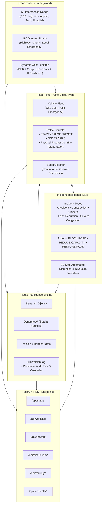

# Intelligent Urban Traffic Digital Twin Platform

A mathematically grounded, production-ready platform for intelligent urban traffic management, simulation, and predictive routing, comprised of:

1. **Dynamic Urban Traffic Graph Foundation**: Weighted directed graph representation with dynamic BPR flow curves, incident penalties, and continuous graph state synchronization.
2. **Real-Time Traffic Digital Twin**: Deterministic tick-based traffic simulator with physical vehicle progression, multi-class vehicles, simulation controls (`START`, `PAUSE`, `RESET`, `ADD TRAFFIC`), and continuous state observation.
3. **Dynamic Route Intelligence Engine**: Context-aware routing engine featuring Dijkstra, A*, and Yen's K-Shortest Paths algorithms with dynamic cost evaluation, congestion avoidance, and AI Decision Log explanations.
4. **Incident Intelligence Layer**: Real-time disruption modeling with physical road capacity/speed degradation, automated fleet diversion, and cascading AI Decision Log event tracking.
5. **Traffic Intelligence Memory & AI Congestion Prediction**: High-performance observation memory buffer (`TrafficHistory`), 8-parameter temporal feature engineering (`PredictionDatasetBuilder`), multi-horizon XGBoost regression (`CongestionPredictor`), and proactive routing feedback anticipation loops.
6. **Network-Level Traffic Redistribution Engine**: System-wide flow optimization with continuous hotspot detection (5 categories), future corridor capacity projection, **Congestion Migration Prevention**, empirical **Network Health Score (0 - 100)**, and multi-variable objective minimization.
7. **REST API Interface**: FastAPI endpoints exposing simulation telemetry, vehicle tracking, network congestion states, incident management, AI congestion predictions, network health, hotspots, and on-demand route planning.

---

## 🏛️ System Architecture



---

## 💥 Incident Intelligence Layer

The Incident Intelligence layer physically affects the network graph and simulator behavior rather than merely changing road display attributes.

### Supported Incident Types:
- `accident`: Vehicle collisions causing severe bottlenecks and lane blockages.
- `construction`: Roadwork zones causing sustained lane capacity reductions.
- `temporary_closure`: Complete roadway closures for maintenance or security.
- `lane_reduction`: Physical reduction in operational lanes (e.g. 1 of 3 lanes closed).
- `severe_congestion_event`: Hyper-dense gridlock surges.

### Core Incident Operations:
- **`BLOCK ROAD`**:
  Sets road capacity reduction to 100%, dynamic cost to $\infty$, operational speed to $0\text{ km/h}$, and `is_blocked = True`.
- **`REDUCE CAPACITY`**:
  Scales down nominal capacity by $R \in [0.05, 0.99]$, drops operational speed, spikes congestion ratio ($u = \frac{v}{C_{\text{effective}}}$), and triggers rerouting.
- **`RESTORE ROAD`**:
  Restores original nominal capacity and speed limit, clears closures, recalculates dynamic costs, and records resolution in the AI Decision Log.

---

## ⚡ The 10-Step Incident Workflow

When an incident occurs:
1. **Update the affected road**: Assigns incident status and description.
2. **Update its capacity/speed**: Applies physical capacity reduction and speed degradation.
3. **Recalculate its routing cost**: Dynamic traversal cost surges (or becomes $\infty$ if blocked).
4. **Identify vehicles whose routes are affected**: Inspects active and waiting vehicles whose remaining paths traverse the affected road.
5. **Generate alternative routes**: Uses Yen's KSP / Dynamic Dijkstra on the modified network.
6. **Automatically reroute affected vehicles**: Updates each vehicle's forward path to avoid the disruption.
7. **Record the old route**: Captures the original trajectory.
8. **Record the new route**: Captures the diverted trajectory.
9. **Increment reroute count**: Increments `reroute_count` on all diverted vehicles.
10. **Add an event to the AI Decision Log**: Records a cascading event chain and detailed log entries.

### Cascading AI Decision Log Format:
```
ACCIDENT DETECTED
|
v
Road North Radial Expressway (HUB_CBD -> INT_INNER_N) capacity reduced by 70%
|
v
15 active vehicles affected
|
v
Alternative routes evaluated
|
v
15 vehicles rerouted
|
v
Network redistribution started
```

---

## 🧠 Traffic Intelligence Memory & AI Congestion Prediction Layer

The Traffic Intelligence Memory and AI Congestion Prediction Layer provides genuine machine learning on top of physical digital twin history—with strictly **zero fabricated prediction values**.

### 1. Traffic History Memory (`TrafficHistory` & `TrafficRecord`)
- Stores fine-grained chronological physical observations per road edge:
  - `tick`, `road_id`, `vehicle_count`, `capacity`, `current_speed`, `congestion_ratio`, `congestion_level`.
- Real-time subscriber to `TrafficSimulator` state publisher, automatically recording observations on every simulation tick.

### 2. Temporal Feature Engineering (`PredictionDatasetBuilder`)
Constructs an 8-parameter temporal feature vector per roadway:
1. `current_traffic_ratio`: Instantaneous utilization ratio $u_t = \frac{v_t}{C}$.
2. `previous_traffic_ratio`: Preceding tick utilization $u_{t-1}$.
3. `traffic_change_rate`: Utilization slope $\Delta u = u_t - u_{t-1}$.
4. `recent_average_traffic`: Rolling window average utilization over past $W$ ticks.
5. `recent_maximum_traffic`: Peak congestion experienced in recent window.
6. `road_capacity`: Nominal/effective vehicle capacity.
7. `current_speed`: Empirical operational speed in $\text{km/h}$.
8. `time_tick`: Current simulation clock tick.

### 3. Machine Learning Model (`CongestionPredictor`)
- Powered by an **XGBoost Regressor (`xgb.XGBRegressor`)** with configurable forecast horizons (e.g. $t+5$ ticks, $t+10$ ticks).
- **Graceful handling of insufficient history**:
  If the simulator has not yet accumulated sufficient historical data, the predictor strictly reports:
  ```json
  "prediction_status": "AI STATUS: COLLECTING TRAFFIC HISTORY"
  ```
  with `confidence_metric: null` and `predicted_congestion = current_congestion` without inventing speculative values.

### 4. Proactive Routing Feedback Loop
AI predictions are not a decorative dashboard feature—they actively influence dynamic routing costs. When `apply_predictions_to_network` is invoked:
$$\Delta_{\text{pred}} = T_0 \times 2.5 \times (\hat{u}_{t+H} - 0.70)^2 \times W_{\text{sensitivity}} \quad (\text{for } \hat{u}_{t+H} \ge 0.70)$$
This anticipation penalty raises `road.predicted_congestion_penalty` and `road.dynamic_cost`, proactively diverting upcoming vehicles onto uncongested corridors *before* physical gridlock forms.

---

## 🔮 Predictive Route Intelligence Engine

The Predictive Routing Engine directly connects the AI Congestion Prediction Layer to Dynamic Route Intelligence. The routing system no longer optimizes solely for current traffic; it anticipates future network states.

### 1. The 5 Mandatory Candidate Route Calculations
For every evaluated route alternative, the engine computes:
1. **Current travel cost**: Traversal travel time and live delay under current road conditions.
2. **Current congestion exposure**: Fraction of total route distance experiencing heavy/severe congestion ($u \ge 0.80$).
3. **Predicted congestion exposure**: Fraction of total route distance predicted to face heavy/severe congestion ($\hat{u} \ge 0.75$) within the target horizon.
4. **Incident risk**: Disruption penalty and risk exposure from active closures or construction.
5. **Estimated travel time**: Total estimated travel time in minutes based on real-time and predicted speeds.

### 2. Predictive Route Cost Formula
$$\text{Predictive Route Cost} = \text{current\_cost} + \text{future\_congestion\_cost} + \text{incident\_risk\_cost}$$

Where:
- $\text{current\_cost} = \text{distance\_cost} + \text{current\_congestion\_penalty}$
- $\text{future\_congestion\_cost} = \sum_{\text{edges}} T_0 \times 35.0 \times (\hat{u}_{t+H} - 0.70)^2 \quad (\text{for } \hat{u}_{t+H} \ge 0.70)$
- $\text{incident\_risk\_cost} = \text{incident\_penalty}$

### 3. Bottleneck Avoidance Tradeoff (Route A vs Route B)
| Metric | Route A (Direct) | Route B (Detour) |
| :--- | :--- | :--- |
| **Distance** | Shorter (4.20 km) | Slightly longer (4.63 km) |
| **Current Congestion** | **45.0%** (lower current delay) | 55.0% |
| **Predicted Congestion (10 ticks)** | **92.0%** (impending severe bottleneck) | **61.0%** (stable flow) |
| **Future Congestion Cost** | **+4.74 min** | **0.00 min** |
| **Predictive Route Cost** | **7.60 min** | **4.15 min [WINNER]** |

The system selects **Route B** because taking the slightly longer route avoids the upcoming gridlock bottleneck.

### 4. Structured AI Decision Explanation (`CURRENT → PREDICTED → DECISION`)
```
CURRENT:
  Route_A current congestion: 45% (2.9 min) vs Route_B current congestion: 55% (4.2 min)
|
v
PREDICTED:
  Route_A predicted congestion: 92% within 10 ticks (future delay +4.7 min) vs Route_B predicted congestion: 61% (future delay +0.0 min)
|
v
DECISION:
  Route_B selected because Route_A is predicted to become severely congested within 10 ticks.
```

---

## 🚦 Network-Level Traffic Redistribution Engine

The system optimizes the entire transportation network rather than merely individual vehicles, balancing global flows across arterial and orbital corridors.

### 1. Continuous Hotspot & Flow Condition Detection
The `HotspotDetector` continuously categorizes network segments into 5 operational flow conditions:
- **Congestion Hotspots**: Roads with utilization $u \ge 0.80$ or in Heavy/Severe congestion tiers.
- **Overloaded Roads**: Critical segments with $u \ge 1.00$ where volume exceeds nominal road capacity.
- **Underutilized Alternatives**: Corridors with low utilization ($u \le 0.55$) and significant spare capacity available to absorb diversions.
- **Emerging Bottlenecks**: Segments with moderate utilization ($u \ge 0.60$) and positive rate of congestion growth ($\frac{du}{dt} > 0$).
- **Predicted Congestion Zones**: Segments where AI forecasts future severe congestion ($\hat{u} \ge 0.75$) within the horizon.

### 2. The 6-Step Redistribution Workflow
When bottlenecks or hotspots emerge:
1. **Find alternative corridors**: Identifies multi-path candidate detours using Predictive Route Intelligence.
2. **Estimate future capacity**: Calculates prospective load and absorbable capacity ($C_{\text{alt}} \times u_{\text{target}} - \text{load}$).
3. **Evaluate rerouting candidates**: Analyzes active vehicles traversing the hotspot.
4. **Enforce Congestion Migration Prevention**: Blocks any redistribution if diverting vehicles would overload an alternative corridor beyond target capacity ($80\%$).
5. **Reroute only when beneficial**: Verifies that the network-level objective function $J$ is improved before enacting vehicle route modifications.
6. **Recalculate network state**: Updates vehicle routes, recalculates road states, logs the event in the AI Decision Log, and audits simulation metrics.

### 3. Network-Level Objective Function
$$\min J = W_{\text{time}} \cdot T_{\text{travel}} + W_{\text{cong}} \cdot P_{\text{cong}} + W_{\text{reroute}} \cdot N_{\text{reroute}} + W_{\text{severe}} \cdot N_{\text{severe}}$$

Where:
- $T_{\text{travel}}$: Total fleet remaining travel time across all active vehicles.
- $P_{\text{cong}}$: Sum of weighted BPR congestion penalties across all roads.
- $N_{\text{reroute}}$: Cumulative reroutes performed (discouraging excessive oscillations).
- $N_{\text{severe}}$: Total number of road segments experiencing severe congestion.

### 4. Empirical Network Health Score (0 - 100)
Based strictly on real simulation measurements ("Do not claim improvement unless measured by the simulation"):
$$\text{Health Score} = 100 - \Delta_{\text{speed}} - \Delta_{\text{util}} - \Delta_{\text{severe}} - \Delta_{\text{blocked}}$$
- **Tiers**: `EXCELLENT` ($\ge 85$), `GOOD` ($\ge 70$), `DEGRADED` ($\ge 50$), `CRITICAL` ($< 50$).
- **Tracked Telemetry Metrics**: Average travel time, average network speed, total congestion volume, severe roads count, network utilization ratio, cumulative reroutes, and completed vehicles.

---

## 🌐 REST API Specifications

| Method | Endpoint | Description |
| :--- | :--- | :--- |
| `GET` | `/api/status` | Digital twin running state, current tick, vehicle counts, and network utilization. |
| `GET` | `/api/vehicles` | Real-time vehicle telemetry with optional filters (`status`, `vehicle_type`, `limit`). |
| `GET` | `/api/network` | Live network congestion snapshot, average speed, and road-level states. |
| `GET` | `/api/network/health` | Empirical Network Health Score (0-100) and objective $J$ based on live telemetry. |
| `GET` | `/api/network/hotspots` | Continuous identification across 5 flow conditions (hotspots, overloaded, emerging, predicted, underutilized). |
| `POST` | `/api/network/redistribute` | Execute system-wide traffic redistribution enforcing Congestion Migration Prevention. |
| `POST` | `/api/simulation/start` | Start or resume simulation clock. |
| `POST` | `/api/simulation/pause` | Pause simulation clock. |
| `POST` | `/api/simulation/reset` | Clear all vehicles and restore network baseline. |
| `POST` | `/api/simulation/tick` | Advance simulation by $N$ ticks (`{"steps": 1}`). |
| `POST` | `/api/simulation/traffic` | Inject vehicles into simulation (`{"count": 10, "vehicle_type": "car"}`). |
| `POST` | `/api/routing/plan` | Solve dynamic route with alternatives and AI explanation. |
| `POST` | `/api/routing/predictive_plan` | Solve predictive route with 5 metrics, future cost, and CURRENT->PREDICTED->DECISION breakdown. |
| `GET` | `/api/routing/decision_log` | Retrieve structured AI route decision explanations. |
| `POST` | `/api/routing/reroute_fleet` | Proactively divert active vehicles facing heavy live bottlenecks. |
| `POST` | `/api/routing/predictive_reroute_fleet` | Proactively divert active vehicles facing impending predicted bottlenecks. |
| `POST` | `/api/incidents/block` | Complete physical road closure and trigger fleet diversion. |
| `POST` | `/api/incidents/reduce_capacity` | Partial roadway restriction and traffic redistribution. |
| `POST` | `/api/incidents/restore` | Reopen road and restore nominal capacity. |
| `GET` | `/api/incidents/active` | List all currently active network incidents. |
| `GET` | `/api/incidents/history` | List historical log of all incidents. |
| `GET` | `/api/prediction` | Forecast future congestion for all roads or specified `?road_id=...`. |
| `GET` | `/api/prediction/{road_id}` | Forecast future congestion for a specific road segment. |
| `POST` | `/api/prediction/train` | Train XGBoost model on accumulated simulation history. |
| `POST` | `/api/prediction/apply` | Feed predictions into dynamic graph costs as anticipation penalties. |
| `GET` | `/api/graph/topology` | Spatial Euclidean coordinates for 56 nodes and 196 directed road geometries for vector rendering. |
| `POST` | `/api/emergency/dispatch` | High-priority emergency vehicle dispatch & automated Green Corridor creation. |
| `GET` | `/api/emergency/missions` | Real-time status and telemetry of all emergency dispatch missions. |
| `GET` | `/api/emergency/corridors` | Active and forming Green Corridors with cleared vehicle counts. |
| `POST` | `/api/adaptive/step` | Advance autonomous closed-loop cycle (OBSERVE->PREDICT->DECIDE->ACT->MEASURE->LEARN). |
| `GET` | `/api/adaptive/timeline` | Autonomous decision and mitigation event stream. |
| `POST` | `/api/experiment/run` | Benchmark Static vs Dynamic vs Predictive Routing across identical initial workloads. |

---

## 🚑 Module 9: Emergency Vehicle Intelligence & Green Corridors

Priority-aware routing designed for ambulances, fire engines, and police units:
- **Green Corridor Formation**: Dynamic route reservation identifying all links along the emergency path.
- **Preemptive Traffic Clearance**: Surrounding civilian traffic on corridor links is proactively rerouted to alternative paths *before* the emergency vehicle arrives, minimizing junction interference.
- **Clearance Auditing**: Measures actual vehicles cleared and time saved per emergency mission.

---

## 🔬 Module 10: Routing Intelligence Experiment Lab

Head-to-head empirical testing environment executing the exact same workload across three paradigms:
1. **Static Routing**: Fixed shortest-path computed once at departure using free-flow costs.
2. **Dynamic Routing**: Reactive routing updating costs based purely on current live traffic conditions.
3. **Predictive Dynamic Routing**: Proactive routing evaluating both current congestion and future bottleneck probabilities via XGBoost ($T_{\text{curr}} + T_{\text{pred}} + \text{Risk}$).

**Empirical Metrics Measured**: Average travel time, network-wide average speed, reroute frequency, completion rate, and severe congestion exposure duration.

---

## 🔄 Module 11: Closed-Loop Adaptive Controller

The autonomous central governor executing the continuous self-optimizing control loop:
```
TRAFFIC -> OBSERVE -> PREDICT -> DECIDE -> ACT -> MEASURE -> LEARN -> REPEAT
```
- Tracks empirical before/after network health deltas for every system action.
- Periodically triggers incremental training of the prediction model on accumulated digital twin history.
- Maintains a persistent, timestamped AI Decision Timeline.

---

## 💻 Module 12: Premium Command Center UI

Dark-aesthetic command-center dashboard built with **React 18, Vite, Tailwind CSS, Lucide, and Recharts**:
- **Offline Synthetic Vector Map**: Real-time canvas/SVG projection of all 56 intersections and 196 directed roads with dynamic congestion color coding, pulsing incident markers, glowing Green Corridors, and animated vehicle dots with emergency priority beacons.
- **Simulation Controls**: Live `START`, `PAUSE`, `RESET`, `TICK`, and traffic injection (+20, +50, +150 vehicles).
- **Physical Incident Control**: Interactive road selection to inject work zones, partial lane reductions, or complete road closures.
- **AI Decision Stream**: Live timeline displaying the `CURRENT -> PREDICTED -> DECISION` explanation chain.
- **Interactive Modals**: Routing Lab comparison suite, Emergency Mission dispatch console, and Incident injector.

---

## 🧪 Verification & Demonstration Scripts

### Run Full System End-to-End Demonstration (5 Phases)
```powershell
python examples/demo_full_system.py
```

### Run Network-Level Traffic Redistribution Demonstration
```powershell
python examples/demo_network_redistribution.py
```

### Run Predictive Routing Engine Demonstration
```powershell
python examples/demo_predictive_routing.py
```

### Run Full Test Suite (79 Automated Tests)
```powershell
pytest -v
```

### Start Backend REST API Server
```powershell
uvicorn digital_twin.api:create_app --factory --host 127.0.0.1 --port 8000
```

### Launch React Frontend Dashboard
```powershell
cd frontend
npm run dev
```
Navigate to `http://localhost:3000` to interact with the Command Center UI.
